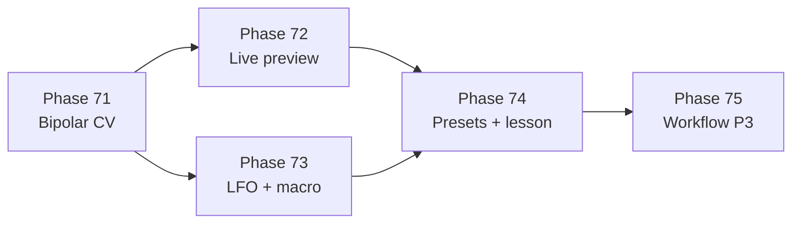

# Pro Modulation Implementation Plan

> **GSD milestone:** `.planning/ROADMAP.md` phases **71–75**  
> **Status:** ✅ Shipped — phases 71–75 complete (2026-06-16)

---

## Why this milestone

Research sprints (cycles 1–3) and GitHits review confirm: Patch Lab has the **nodes** pros use, but not the **modulation UX** they expect:

| Pro expectation | Today | Phase |
|-----------------|-------|-------|
| Bipolar/attenuverter on every mod route | Unipolar 0…2 depth only | **71** |
| See effective param while LFO runs | Static knob value | **72** |
| S&H / key-track / macro | Partial (custom LFO, rateRatio) | **73** |
| Reference presets + lesson | 18 presets, no mod-matrix lesson | **74** |
| Resample + scope descriptors | P3 not built | **75** |

Grounding: arXiv:2510.06204, synflow mod matrix, audio-nodes live preview, Preset Drive FM + dual-LFO guides.

---

## Execution order



**Estimated effort:** 71–74 ≈ 4 focused sessions; 75 optional stretch.

---

## Commit checkpoints

| After phase | Commit type | Push? |
|-------------|-------------|-------|
| 71 | `feat(patch): bipolar CV routing` | when ready |
| 72 | `feat(patch): live mod preview` | when ready |
| 73 | `feat(patch): macro and advanced LFO` | when ready |
| 74 | `feat(patch): pro presets and lesson 07` | milestone |
| 75 | split per 75a/b/c | optional |

Each phase **must** include: code + tests + doc touch + CHANGELOG unreleased bullet.

---

## Phase plans (detail)

| Phase | PLAN.md |
|-------|---------|
| 71 | [.planning/phases/71-bipolar-cv-attenuation/PLAN.md](../.planning/phases/71-bipolar-cv-attenuation/PLAN.md) |
| 72 | [.planning/phases/72-live-mod-preview/PLAN.md](../.planning/phases/72-live-mod-preview/PLAN.md) |
| 73 | [.planning/phases/73-advanced-lfo-macro/PLAN.md](../.planning/phases/73-advanced-lfo-macro/PLAN.md) |
| 74 | [.planning/phases/74-pro-presets-verification/PLAN.md](../.planning/phases/74-pro-presets-verification/PLAN.md) |
| 75 | [.planning/phases/75-workflow-p3/PLAN.md](../.planning/phases/75-workflow-p3/PLAN.md) |

---

## Definition of done

Milestone complete when `.planning/ROADMAP.md` checklist is fully checked and:

1. A producer can build **dual-LFO growl + sub stack** entirely in Patch Lab
2. Mod matrix shows **bipolar depth + offset** per cable
3. **Lesson 07** walks through it without DAW handoff
4. `npm test` and graph extract pass

---

## How to start

```bash
# Agent mode — execute phase 71
/gsd-execute-phase 71

# Or manual
cat .planning/phases/71-bipolar-cv-attenuation/PLAN.md
# implement → test → docs → commit
```

---

## Related docs

- `docs/research/riddim-feature-roadmap.md` — Phase D table (update on 74)
- `docs/research/riddim-research-loop.md` — research provenance
- `graph/research/riddim-supplement.json` — technique nodes
