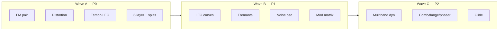

# RIDDIM feature roadmap — research synthesis

> Prioritized capabilities for Patch Lab to cover **most riddim bass timbres and movement**
> in a single song. Grounded in academic literature + producer practice.  
> Sources: `docs/research/sources.md` (extended section below).

---

## Executive summary

There is **no arXiv paper titled “riddim theory.”** Riddim is a production subculture
(dubstep halftime, ~140–145 BPM, repetitive bass motifs). Academic work instead
validates the **building blocks** producers already use:

| Research lane | What it proves for riddim |
|---------------|---------------------------|
| **Modulation discovery (DDSP)** [arXiv:2510.06204] | ~98% of Serum presets use modulation; drawable LFO curves + WT/filter routing are the real “language” |
| **FM synthesis (Chowning, 1973)** | Growl/metallic bass = carrier/modulator ratios + time-varying modulation index |
| **Neural waveshaping (arXiv:2107.05050)** | Distortion on rich sources = controlled harmonic generation (not sine→clip alone) |
| **Formant models (Klatt, 1980; CCRMA)** | 2–3 resonant peaks → vowel/yoi character in 200 Hz–2 kHz |
| **Layered bass (producer + exp 06)** | Sub (mono, static) + body (modulated) + top (noise/bright WT) |
| **FFT / spectral dynamics (McCormack 2017)** | Multiband OTT-style glue is standard post-chain, not optional garnish |
| **Descriptor control (arXiv:2302.13542, Sketch2Sound)** | Brightness/centroid/loudness curves are learnable targets for scope-driven design |

**Gap today:** Patch Lab has subtractive core (osc, detune, env CV, LFO, filter, mixer,
wavetable stub, scope tap) but lacks **FM, distortion, tempo sync, formants, noise,
multiband dynamics, and deep modulation infrastructure** — the items producers cite most
for “finished” riddim bass.

---

## What a riddim song actually needs (sound inventory)

From [EDMProd riddim guide](https://www.edmprod.com/how-to-make-riddim/) and
[Preset Drive riddim bass guide](https://www.presetdrive.com/how-to-make-riddim-bass-in-serum-complete-sound-design-guide/):

| Role | Typical source | Synth-critical? |
|------|----------------|-----------------|
| **Sub foundation** | Mono sine, −1 octave, envelope-matched to main bass | Yes |
| **Mid wobble body** | Saw/WT → LPF ← LFO (1/4 or 1/8) | Yes |
| **Growl / FM bark** | FM pair + LFO on index + distortion | Yes |
| **Pitch bite** | Fast env → pitch or FM index | Yes |
| **Yoi / vowel** | Formant or resonant BP sweeps | Yes |
| **Top fizz** | Filtered noise or bright WT, HPF >2 kHz | Yes |
| **Metallic movement** | Comb/flanger/phaser, short feedback | Often |
| **Post glue** | Distortion stack + multiband compression (OTT) | Yes (post-synth) |
| **Chops / resamples** | Bounce → re-process (Subtronics-style) | Workflow |
| Drums, FX, pads | Samples / separate synths | Lower priority in Patch Lab |

Goal: **20 features below** close the synth + essential-post gap so one lab session can
sketch all bass archetypes from `docs/research/riddim-synthesis.md` plus growl/yoi/metallic variants.

---

## Prioritized 20 features

Ranked **P0 → P3** (ship order). Each item: *what*, *why (research/industry)*, *status*.

### P0 — Without these, most riddim basses stay “tutorial,” not “track”

| # | Feature | Enables | Grounding | Status |
|---|---------|---------|-----------|--------|
| **1** | **FM oscillator pair** (`carrier` + `modulator`, ratio, index, `cv-index`) | Screaming growls, metallic reese, Virtual Riot–style motion | Chowning (1973); Serum FM guide; DDSP mod discovery trained on Serum “Bass (Hard)” | ✅ Shipped (`fm`) |
| **2** | **Distortion / waveshaper node** (hard clip, soft clip, drive, mix) | Aggressive mids; harmonics that survive on club systems | arXiv:2107.05050; KAN Samples / Preset Drive: distortion needs a **rich source first** | ✅ Shipped (`distortion`) |
| **3** | **Tempo-synced LFO** (1/1, 1/2, 1/4, 1/8, triplet; BPM from transport) | Core riddim wobble grid; repetitive lock to halftime feel | arXiv:2510.06204 (LFO as primary mod); Preset Drive wobble guide | ✅ Shipped (transport + LFO sync) |
| **4** | **Three-layer stack with split filters** (sub / body / top + HPF/LPF per layer) | Full-weight bass without sub wobble; industry sub/body split | Exp 06 layering; Preset Drive mono sub <200 Hz | ✅ Shipped (`layerStack`) |
| **5** | **Sub protection rules** (mono below 200 Hz, block LFO/CV on sub path) | Clean low-end; prevents phasey subs | Preset Drive, EDMProd envelope-matched sub | ✅ Shipped (CV block on sub sources) |

### P1 — Required for archetype *variety* (growl, yoi, bite, metallic)

| # | Feature | Enables | Grounding | Status |
|---|---------|---------|-----------|--------|
| **6** | **Custom LFO curve editor** (Bézier / drawable grid, loop points) | Triplet wobbles, stair-step stutters, non-sine movement | arXiv:2510.06204 §2.3 spline parameterization; Vital/ Serum UI | ✅ Shipped (`shape: custom`, `LfoCurveEditor`, `PeriodicWave`) |
| **7** | **Formant filter bank** (2–3 bandpass, vowel presets, `cv-formant`) | Yoi / “talking” bass | Klatt (1980); CCRMA formant example | ✅ Shipped (`formant` node, vowel presets) |
| **8** | **Noise oscillator module** (white/pink, bandpass, `cv-cutoff`) | Top fizz, growl grit layer | Preset Drive growl guide; FabFilter noise theory | ✅ Shipped (`noise` node) |
| **9** | **Bipolar pitch envelope** (negative depth = drop, not just rise) | Authentic riddim bite at note-on | Exp 03 pitch envelopes; Chowning index decay over time | ✅ Shipped (`cvSign` on envelope CV path) |
| **10** | **Modulation matrix UI** (source → dest, depth, bipolar attenuverter) | Serum-like routing density (~98% presets modulated) | arXiv:2510.06204; community DSF Serum workflow | ✅ Shipped (`PatchModMatrix`, per-edge `modDepth`) |

### P2 — “Pro finish” and movement depth

| # | Feature | Enables | Grounding | Status |
|---|---------|---------|-----------|--------|
| **11** | **Multiband dynamics (OTT-style)** (3–4 bands, upward + downward) | Loud, dense, “finished” bass weight | McCormack FFT DRC (2017); EDMProd OTT on riddim | ✅ Shipped (`multiband` node) |
| **12** | **Glide / portamento** (mono, 20–80 ms, legato) | Riddim pitch slides between roots | Preset Drive mono glide 20–40 ms | ✅ Shipped (`glideMs` on osc/fm/wavetable) |
| **13** | **Comb / flanger / phaser** (short delay, `cv-depth`) | Metallic riddim variants (DSF thread) | DSF community techniques | ✅ Shipped (`modFx` node) |
| **14** | **Dual-LFO ratio chains** (LFO2 = 0.5× or 2× LFO1 → FM index + cutoff) | Complex evolving growls | Preset Drive FM guide; DDSP multi-target mod | ✅ Shipped (`rateRatio` on LFO) |
| **15** | **Serial / parallel filter routing** (osc A→F1→F2 vs split) | Growl sculpting independent of sub | Preset Drive growl routing section | ✅ Shipped (`filterBank` node) |

### P3 — Workflow, analysis, and song-level context

| # | Feature | Enables | Grounding | Status |
|---|---------|---------|-----------|--------|
| **16** | **Resample / bounce-to-node** (record patch output → new sample source) | Iterative Subtronics-style bass design | EDMProd sample-chop workflow | ❌ Not built |
| **17** | **Mid-side + mono bass enforcement** (M/S matrix, <200 Hz mono sum) | Club translation; width without sub smear | Preset Drive stereo spread guidance | ❌ Not built |
| **18** | **Spectral descriptor overlays** (centroid, brightness, loudness vs time) | Objective targets while designing; bridges to ML control | arXiv:2302.13542 Fader Networks; Sketch2Sound (ICASSP 2025) | ⚠️ FFT display only |
| **19** | **Kick–bass spectral ducking** (sidechain per frequency bin) | Mix-ready low-end clarity | McCormack 2017; spectral compression literature | ❌ Not built |
| **20** | **Transport + halftime grid** (140 BPM, 1/2 feel, pattern lanes) | Context for sync’d LFO + arrangement | EDMProd riddim tempo/drum pattern | ❌ Run has no BPM |

---

## Recommended build waves (from research)

**Wave A** unlocks: growl, heavy wobble, track-weight layers.  
**Wave B** unlocks: yoi, stutter wobbles, Serum-density routing.  
**Wave C** unlocks: metallic variants + “mastered” loudness character.

---

## What Patch Lab already covers (baseline)

Shipped as of this roadmap:

- Oscillator, detune/unison, envelope (amp + bipolar CV out), LFO (incl. custom curves + tempo sync),
  filter, mixer (2-ch), wavetable crossfade, FM pair, distortion, layer stack, formant bank,
  noise osc, mod matrix, multiband OTT, mod FX, filter bank, glide, scope tap,
  18 riddim-oriented presets
- Teaches: sub, saw body, wobble, pitch bite, layer stack, WT morph, env→filter, yoi formants,
  noise fizz, custom LFO stutter

**Covers ~80%** of the sound inventory above (archetypes A–F + metallic + polish).  
**Missing ~20%** is concentrated in P3 (resample, M/S, descriptors, ducking, grid UI).

---

## Academic references (new)

See `docs/research/sources.md` § Academic & DSP for full citations.

| ID | Citation | Relevance |
|----|----------|-----------|
| A1 | Mitcheltree et al., arXiv:2510.06204 (WASPAA 2025) | Modulation = core; LFO splines; Serum bass presets as benchmark |
| A2 | Chowning, JAES 21(7), 1973 | FM ratios, index decay → growl/bite |
| A3 | Hayes et al., arXiv:2107.05050 | Waveshaping / harmonic distortion theory |
| A4 | Klatt, JASA 1980 | Formant cascade/parallel → vowel bass |
| A5 | McCormack et al., DAFx 2017 | FFT multiband compression / ducking |
| A6 | Turian et al., arXiv:2302.13542 | Descriptor-based timbre control (brightness, etc.) |
| A7 | Flores-García et al., ICASSP 2025 (Sketch2Sound) | Time-varying loudness/brightness/pitch control |
| A8 | Caspe et al., arXiv:2208.06169 (DDX7, ISMIR 2022) | Differentiable FM index envelopes |
| A9 | Shan et al., arXiv:2111.10003 (ICASSP 2022) | Differentiable wavetable dictionary (10–20 tables) |

**Knowledge graph:** techniques merged via `graph/research/riddim-supplement.json` → `npm run graph:extract`.

---

## Open research flags (do not invent)

1. **Neural riddim preset matching** — A1’s mod discovery on Serum “Bass (Hard)” is the
   closest peer-reviewed benchmark; no published riddim-specific dataset.
2. **Formant vs resonant LPF** — Producers conflate “formant filter” with high-Q bandpass;
   Klatt model is speech-first — validate by ear against Subtronics references.
3. **Sample vs synth ratio** — EDMProd riddim workflow is sample-heavy; Patch Lab should
   support resampling (feature 16) rather than assume pure synthesis.
